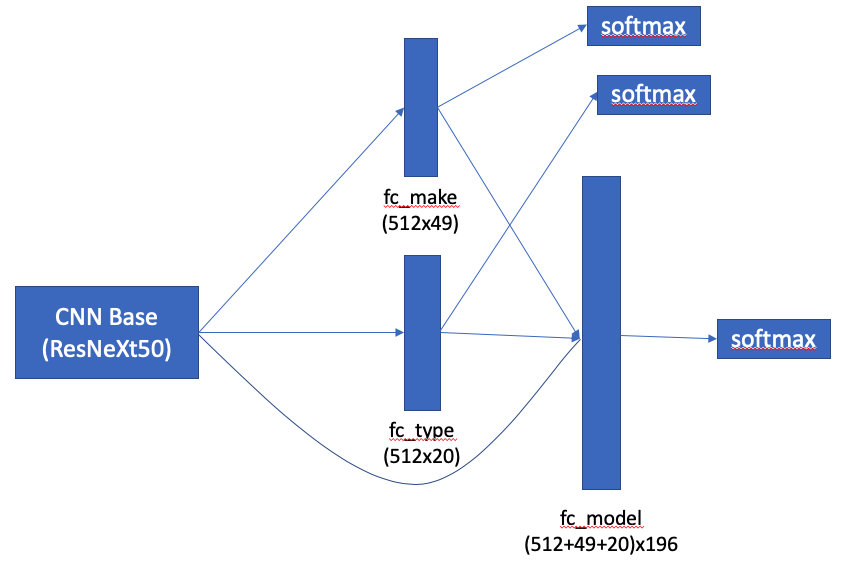
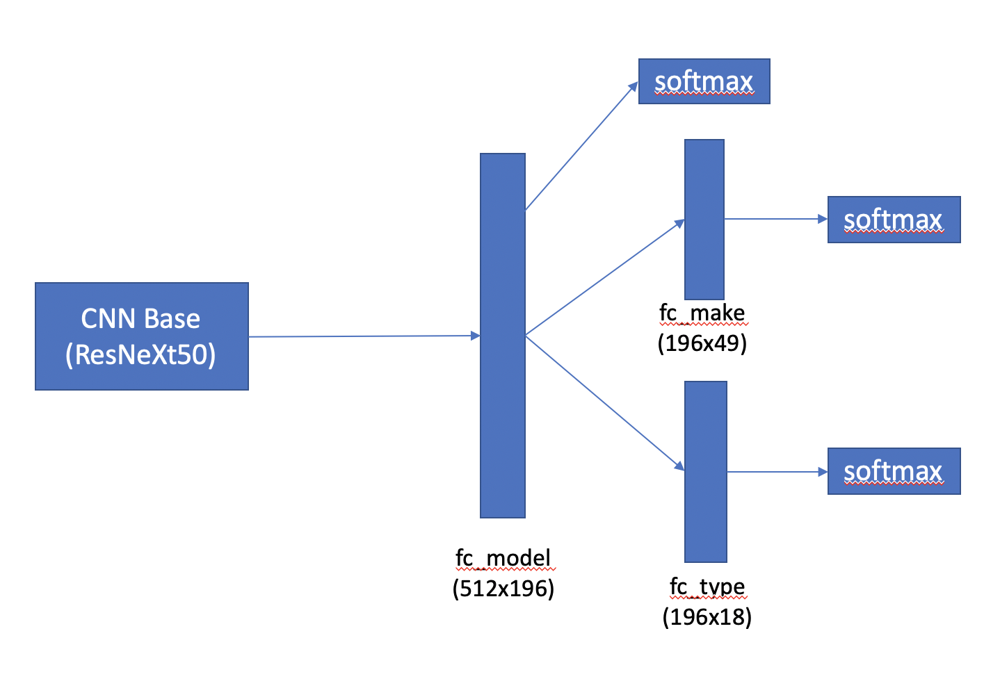

# Grab AI For Sea Computer Vision challenge - Cars Dataset

## Summary

Nowadays in computer vision, deep learning approach is performing superior result and even better than human. I decided to use deep learning approach to solve computer vision challenge in Grab AI For Sea. There is already some [published kernels in Kaggle](https://www.kaggle.com/jutrera/stanford-car-dataset-by-classes-folder/kernels) which I have referred to [their approach](https://www.kaggle.com/deepbear/pytorch-car-classifier-90-accuracy) as my starting point. I have made some changes on training scheme and network architecture. My approach of training scheme is better than baseline from the Kaggle kernel by 0.27% while performing another two tasks. Using state-of-the-art achitecture, performance is improved by 1.66%. I have also shown that not only we need to focus on performance, but also focus on size and computational power, I switched to lower resolution and state-of-the-art deep architecture for mobile, I managed to create a model that is efficient in terms of performance and computational power. 

## Originality

### Originality 1: Multi-task learning training scheme for Car Model, Car Make and Car Type

As the best of my knowledge, there is no published solution on Multi-task learning on Cars dataset. Using this scheme, it has been proven **test accuracy** on `Car Model` is improved by at least 0.1% and the same model is able to perform classification on both `Car Make` and `Car Type` with a very high accuracy at the same time.

### Originality 2: Compression

#### MobileNetV2

By switching architecture to `MobileNetV2`, **test accuracy** is deteriotated by around 1%, however, with 10x smaller in model size. 

#### Weight pruning

By weight pruning on `MobileNetV2` model up to 40%, **test accuracy** is kept at 88%. Refers to table below for more info.

## Architecture

Reference: https://pytorch.org/docs/stable/torchvision/models.html

1. ResNet34 (baseline from Kaggle)
2. ResNeXt50
3. MobileNetV2

### Multi-task learning architecture

##### Version

1. Version 1 - train on Car Model classification task only (196 classes).
2. Version 2, 3 - MTL version, train on Car Model (196 classes), Car Type (18 classes) and Car Make (49 classes) classification tasks.

This is inspired from [YOLO9000](https://arxiv.org/abs/1612.08242), which they were using WordNet concept for Object Detection over 9000 classes.

The following equation is my final loss objective function in this solution:

```L_obj = L_model + lambda_type * L_type + lambda_make * L_make```



From the figure above, using output of base model and connect with two fully connected layers, one for `Car Type` (`fc_type`) and one for `Car Make` (`fc_make`), then both of them are served as extra information to compute `fc_model`.

The motivation is because I hope that `Car Type` and `Car Make` can act as a prior information to help improving in recognizing `Car Model`. As a result, it has been proven this solution can help improving score by at least 0.1%. Even though it is a minor improvement, the model can classify `Car Type` and `Car Make` **at the same time**. 

Theorectically, without using this scheme, we can extract `Car Make` and `Car Type` from fc_model, however, it is troublesome, and it is more to "programming" instead of Deep Learning.

However, using this scheme, performance increased could be due to number of parameters increased to compute `fc_model`, therefore, I made a better version, which has shown in the figure below.



Number of parameters to compute `fc_model` remained, while error propagated from `fc_make` and `fc_type` flowed into `fc_model`, and hence extra gradient information to update weights. As a result, performance is improved. This is also similar to Inception V1 (GoogLeNet), which they performed intermediate softmax branches at the middle.

## Dataset

### Car Model

The Cars dataset is from [Stanford Cars dataset](https://ai.stanford.edu/~jkrause/cars/car_dataset.html) contains 16,185 images of 196 classes of cars.

### Car Make & Car Type

For each class, first word in the class name represents `Car Make` and last word represents `Car Type`, there are total 49 classes of `Car Make` and 18 classes of `Car Type`. Refers to `datasets.py` for more info.

#### Sample Car Make & Car Type

Car Make: 

1. Audi
2. BMW
3. Bentley

Car Type:

1. SUV
2. Sedan
3. Convertible

## Performance Analysis

### Number of parameters

| Architecture        | Number of parameters V1 (M) | Number of parameters V2 (M) |
|---------------------|:---------------------------:|:---------------------------:|
| ResNet34 (baseline) |            21.40            |            21.45            |
| ResNeXt50           |            23.45            |            23.60            |
| MobileNetV2         |            2.509            |            2.608            |

### Car Model, Make, Type test accuracy

| Architecture        | Image Size | Version | Car Model |
|---------------------|:----------:|:-------:|:---------:|
| ResNet34 (baseline) |     224    |    1    |   87.10   |
| -                   |      -     |    2    |   87.50   |
| -                   |     400    |    1    |   92.14   |
| -                   |      -     |    2    |   92.41   |
| MobileNetV2         |     224    |    1    |   87.30   |
| -                   |      -     |    2    |   88.01   |
| -                   |     400    |    1    |   91.89   |
| -                   |      -     |    2    |   91.49   |
| ResNeXt50           |     224    |    1    |   90.83   |
| -                   |      -     |    2    |   91.10   |
| -                   |     400    |    1    |   93.96   |
| -                   |      -     |    2    |   94.07   |
| -                   |      -     |    3    |   94.03   |

The table above shown **test accuracy** of different architecture and image size on Version 1 and 2 for `Car Model`. Using MTL training scheme on ResNet34 with image size of 400, performance is improved by 0.27% from 92.14% to 92.41% which has been proven that prior information of `Car Make` and `Car Type` are useful for final prediction of `Car Model`, not only on baseline but performance on other architecture and image size also have shown improvement by at least 0.1% except for MobileNetV2 with image size of 400. By using state-of-the-art deep architecture ResNeXt50, the performance is even improved by 1.66% and 1.62% on Version 2 and 3 tasks respectively and it is the best performance among all settings.

In terms of compression by using MobileNetV2, the performance on both Version 1 and 2 are only deteriorated by around 1% while 10x smaller size than ResNet34 and ResNeXt50. However, using lower resolution of image size of 224, the performance on both Version 1 and 2 are dropped to 87.30% and 88.01% respectively.

| Architecture | Image Size | Car Make | Car Type |
|--------------|:----------:|:--------:|:--------:|
| ResNet34     |     224    |   92.81  |   94.40  |
| -            |     400    |   96.29  |   96.65  |
| MobileNetV2  |     224    |   92.65  |   93.58  |
| -            |     400    |   95.21  |   95.57  |
| ResNeXt50 V2 |     224    |   95.63  |   96.11  |
| -            |     400    |   97.71  |   97.72  |
| ResNeXt50 V3 |     400    |   97.57  |   97.44  |

The table above shown **test accuracy** of different architecture and image size on Version 2 and 3 for `Car Make` and `Car Type`.

Classification of `Car Make` and `Car Type` using ResNeXt50 V2 with image size of 400, it has the best performance with 97.71% and 97.72% respectively. While on V3 with lesser number of parameters has slightly lower performance which is 97.51% and 97.48% on `Car Make` and `Car Type` respectively.


### Weight Pruning

| Image Size | Version |  Accuracy | Prune Rate 0.1 |  0.2  |  0.3  |  0.4  |  0.5  |  0.6  |  0.7  |  0.8  |  0.9  |
|------------|---------|-----------|:-----------:|-------|-------|-------|-------|-------|-------|------|-------|
| 224        | 1       | Car Model |    87.32    | 86.98 | 86.62 | 85.19 | 78.05 | 57.87 |  1.63 | 0.42 |  0.52 |
| -          | 2       | Car Model |    87.89    | 87.80 | 87.49 | 86.01 | 83.56 | 67.37 |  9.46 | 0.50 |  0.49 |
| -          | -       |  Car Make |    92.39    | 92.33 | 91.97 | 90.56 | 88.12 | 72.99 | 20.73 | 7.75 |  7.75 |
| -          | -       |  Car Type |    93.50    | 93.33 | 93.12 | 91.82 | 90.61 | 77.58 |  7.20 | 3.72 |  3.57 |
| 400        | 1       | Car Model |    91.92    | 91.47 | 90.86 | 88.46 | 80.21 | 30.29 |  1.21 | 0.50 |  0.50 |
| -          | 2       | Car Model |    91.52    | 91.28 | 90.91 | 89.48 | 84.22 | 66.35 |  1.54 | 0.55 |  0.50 |
| -          | -       |  Car Make |    94.96    | 94.68 | 94.24 | 92.42 | 87.32 | 68.46 |  7.93 | 3.20 |  2.91 |
| -          | -       |  Car Type |    95.62    | 95.31 | 95.17 | 94.54 | 91.05 | 78.26 | 18.44 | 0.54 | 23.38 |

The table above shown **test accuracy** after weight pruning on MobileNetV2 using different prune rate. MobileNetV2 can withstand up to 40% of weight pruning while maintaining performance of `Car Model` classification task for Version 1 and 2 at 88.46% and 89.48% respectively

## Usage

Only ResNeXt50 V2 and V3 are uploaded in this repository. 

Test accuracy ResNeXt50 V2: Car Model (94.07%), Car Make (97.71%), Car Type (97.72%).

Test accuracy ResNeXt50 V3: Car Model (94.03%), Car Make (97.51%), Car Type (97.48%)

#### Requirements

1. python==3.6.5
2. torch==1.1.0
3. torchvision==0.3.0
4. numpy
5. pandas

#### Dataset processing

If using [Stanford Cars dataset](https://ai.stanford.edu/~jkrause/cars/car_dataset.html):

- Train dataset need to place in `data/cars_train`. 
- Test dataset need to place in `data/cars_test`. 
- Train annotation need to place in `data/devkit/cars_train_annos.mat`
- Test annotation  need to place in `data/devkit/cars_test_annos_withlabels.mat`

`datasets.py` is responsible for loading dataset and data loader for training and testing. Modifying it if necessary.

#### Network architecture

The model creation is located in `models/` as structured as below:

- `models/`
- `models/__init__.py`
- `models/network_v1.py`
- `models/network_v2.py`

We can use any pretrained `base` network from `torchvision.models` and plug into `NetworkV1` or `NetworkV2` depends on usage

#### Help

```
python train.py --help
python test.py --help
python prune.py --help
```

#### Train
```
python train.py --version 2 --arch resnet34 --imgsize 400 --epochs 60
python train.py --version 2 --arch resnext50 --imgsize 400 --epochs 60
python train.py --version 2 --arch mobilenetv2 --imgsize 224 --epochs 60
```

#### Continue training / finetune 400x400 to 224x224
```
python train.py --version 2 --arch resnext50 --imgsize 224 --epochs 30 --finetune --path logs/resnext50_400_60_v2/1/best.pth --lr 0.001
```

#### Testing with desired image size

Image size can be either `224` or `400`, performance is not guarentee if using other size.

```
python test.py --config logs/resnext50_400_40_v2/1/config.json --imgsize 400
```

#### Check pruning results

```
python prune.py --config logs/resnext50_400_60_v2/1/config.json --prune-rate 0.1
python prune.py --config logs/resnext50_400_60_v2/1/config.json --prune-all
```

## Conclusion

1. Better deep architecture can yield better performance. 
2. Higher resolution can yield better performance.
3. Multi-task learning can improve model performance, also can perform related tasks by the same model.

## Notes

1. All experiments are performed by 1 run only.
2. Experiment on V3 only performed using ResNeXt50.
3. Tuning hyperparameter might improve the performance.

## Reference

1. https://www.kaggle.com/jutrera/stanford-car-dataset-by-classes-folder/kernels
2. https://www.kaggle.com/deepbear/pytorch-car-classifier-90-accuracy
3. https://pytorch.org/docs/stable/torchvision/models.html
4. https://arxiv.org/abs/1612.08242
5. 3D Object Representations for Fine-Grained Categorization
       Jonathan Krause, Michael Stark, Jia Deng, Li Fei-Fei
       4th IEEE Workshop on 3D Representation and Recognition, at ICCV 2013 (3dRR-13). Sydney, Australia. Dec. 8, 2013. (https://ai.stanford.edu/~jkrause/cars/car_dataset.html)
